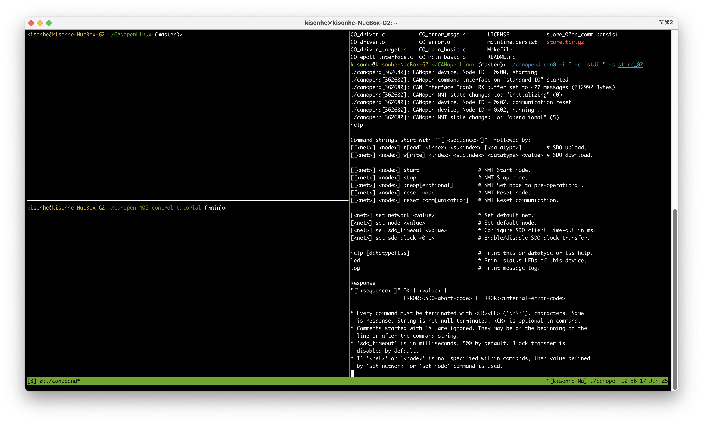
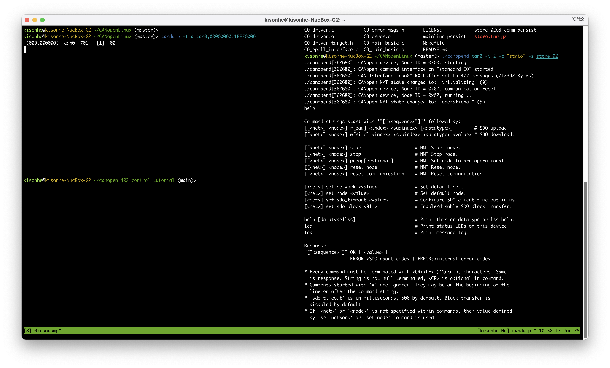
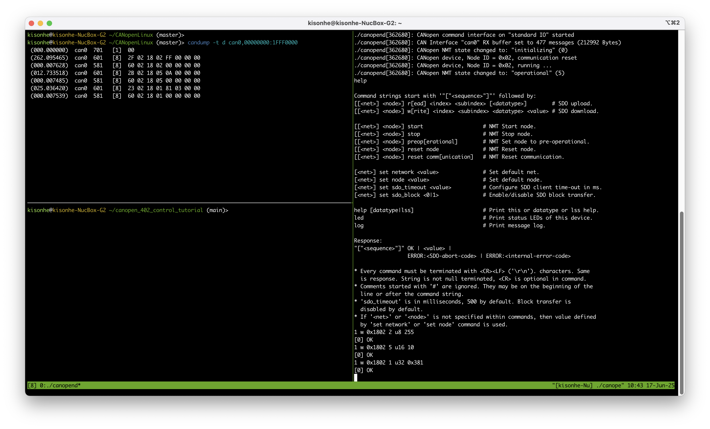
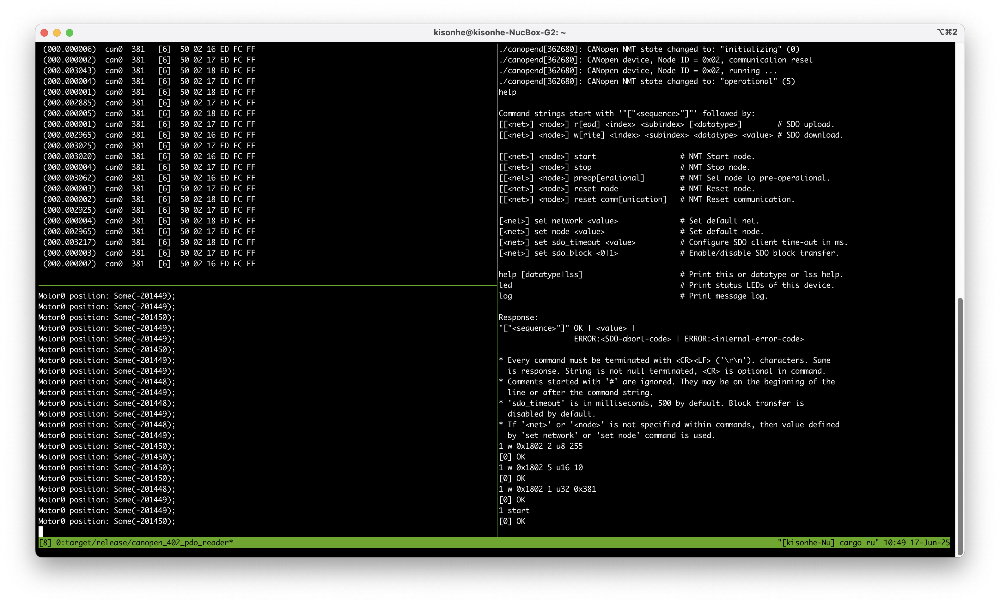
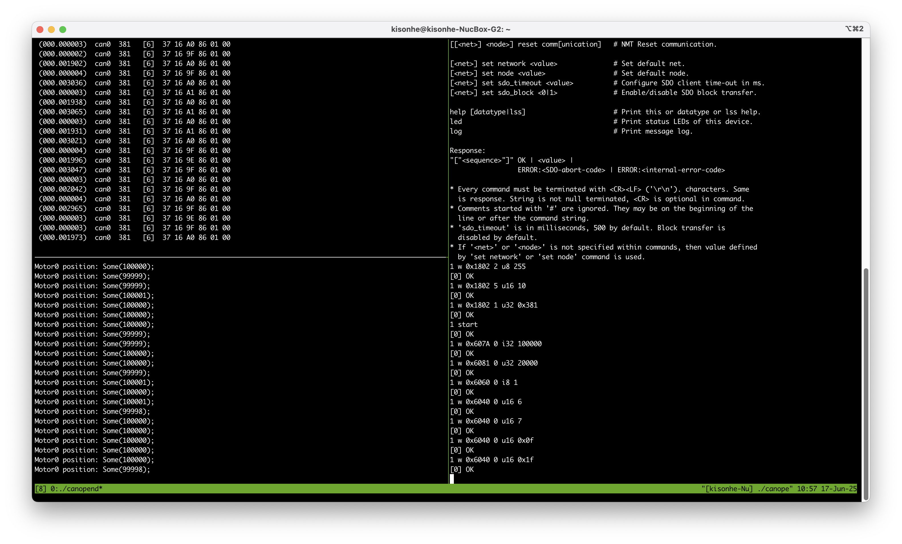
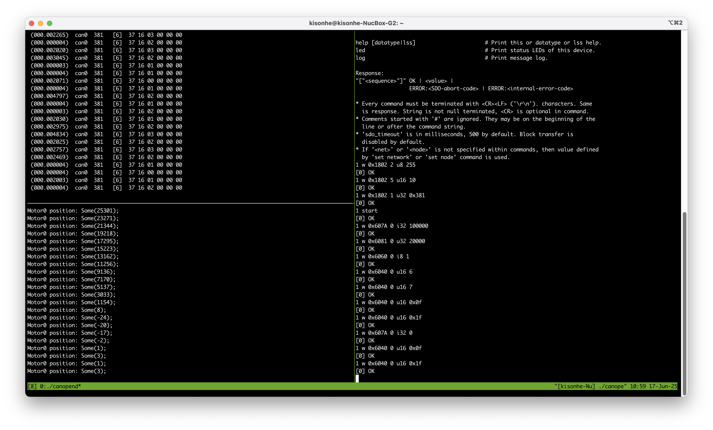
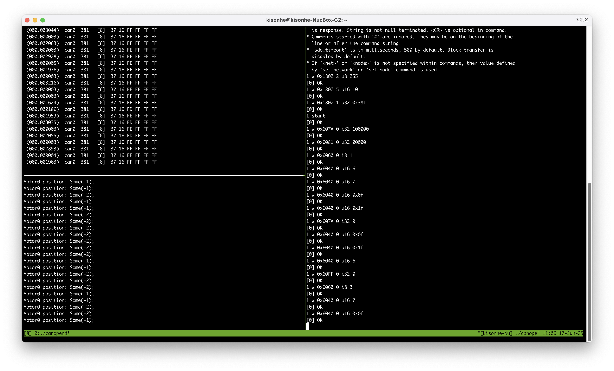
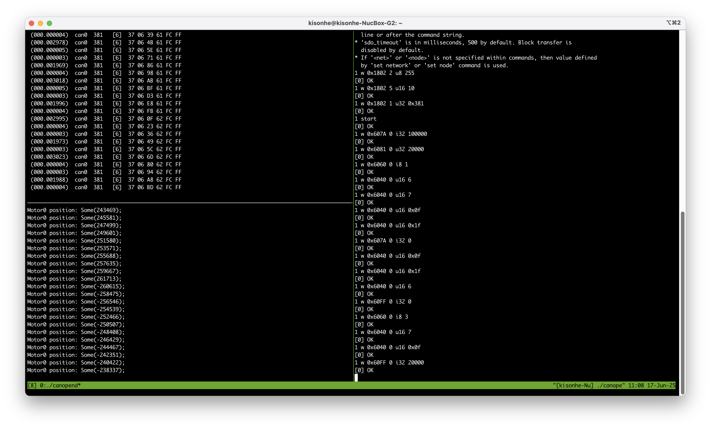

# canopen_402_control_tutorial

This repo provides a very quick way to get the motor with canopen 402 protocol to work.

We will NOT introduce the details of the canopen protocol in this repo, nor the CiA402 protocol in this repo.

## Before we start

Before we start, we need to introduce some basic concepts, the [CANOpen](#canopen) and [CiA402](#cia402).

### CANOpen

CANOpen is being widely used in the industry, it seems complex at first glance, but it is actually very well designed.

Go check [https://www.csselectronics.com/pages/canopen-tutorial-simple-intro](https://www.csselectronics.com/pages/canopen-tutorial-simple-intro) for real quick start.

If you want to know everything about CANOpen, go to CAN in Automation (CiA) website and download CiA301.

### CiA402

We can not redistribute CiA402, but it is possible to get them many ways. Just use Google.

### CANOpen Linux

Of course, never build wheels unless absolutely necessary. There are C++ libs out there ready to use. We will dig into this later.

## Start to move the motor

Now it's get started. First of course, make sure you connect the can bus correctly. It use 500K baud rate, and terminal register is needed.

```bash
sudo ip link set can0 type can bitrate 500000
sudo ip link set can0 up
```

Upon power on, you should receive a heartbeat message from the motor.

### CANOpen Linux

Of course, never build wheels unless absolutely necessary. There are C++ libs out there ready to use. We will dig into this later. We will just use their interactive shell to write Object Dictionary.

First, clone the repo and build binary according to README.md in their repo [https://github.com/CANopenNode/CANopenLinux](https://github.com/CANopenNode/CANopenLinux)


Then, let's bring up the interactive shell by

```bash
./canopend can0 -i 2 -c "stdio"
```

This brings up the interactive shell, you can always type `help` to get the help.



Now turn the power of motor on, we should expect the heartbeat message from the motor. If not, your can bus is probably not working. In this case, the motor's canopen id is 1, so the heartbeat id is `0x701`.



Now, let's config the TPDO Mapping, so we can read the position of the motor.

The default TPDO2 Mapping on this motor is 0x60410010, then 0x60640020. Which is the status word and the position. (Read the CiA402 protocol for more details). So we can skip configuring mapping, just enable the TPDO2.

> You can always re-read the canopen intro to recall what we are doing. Also, setting a candump terminal to see the can bus traffic is always a good idea.

```
1 w 0x1802 2 u8 255
1 w 0x1802 5 u16 10
1 w 0x1802 1 u32 0x381
```



Now, TPDO2 is enabled. We just have to change motor's NMT state to operational to let it start to send the data.

```
1 start
```

Now you can see a lot of data of `0x381`, TPDO2 if Node1. But candump is not very straight forward to read. So we have a small helper program to read the data.

Just run `cargo run --release -- -c can0` (Replace can0 with your can interface name), and this very easy program will start interpreting the data in i32 format.



However, we haven't send any move command to the motor. So the motor is not moving. Now let's get it moving.

I assume you've read the CiA402 protocol already, so I will go straight to the point.

First, let's begin with position control.

> WARNING: The motor will start rotating from now on, make sure your motor is mounted properly, so when it starts rotating, it won't hit anything. Please be careful, this is a powerful motor.

```
1 w 0x607A 0 i32 100000
1 w 0x6081 0 u32 20000
1 w 0x6060 0 i8 1
1 w 0x6040 0 u16 6
1 w 0x6040 0 u16 7
1 w 0x6040 0 u16 0x0f
1 w 0x6040 0 u16 0x1f
```

As you can see in picture 5, the motor has moved to our goal position(`Entry 0x607A`, 100000) using speed of `Entry 0x6081`, 20000.



Now it's make it rotate back to 0.

```
1 w 0x607A 0 i32 0
1 w 0x6040 0 u16 0x0f
1 w 0x6040 0 u16 0x1f
```

As you can see in picture 6, the motor has moved to 0.



Basically, that's how you use the PP(Profile Position) mode.

Now, let's try to use the velocity mode. When you use velocity mode, you would almost definitely want to read the real velocity of the motor back. This can be done configuring TPDO mappings. For the sake of simplicity, we skip it here. Please read the [CANOpen](#canopen) part if you want to try it yourself. It's not that complicated.

Now, disable the motor, set target speed to 0, and change it to PV(Profile Velocity) mode.

```
1 w 0x6040 0 u16 6
1 w 0x60FF 0 i32 0
1 w 0x6060 0 i8 3
1 w 0x6040 0 u16 7
1 w 0x6040 0 u16 0x0f
```

Now the motor is in PV mode. (You can hear its mechanical brake releasing). But it's not moving, because the target speed is 0.



Now, let's set the target speed to 20000.

```
1 w 0x60FF 0 i32 20000
```

Now the motor is moving at 20000, as you can see in picture 8. I also deliberately screenshot the timing when the motor's encoder overflows due to completing a full rotation, because this motor is meant not to rotate more than a whole rotation. Therefore it's configured to overflow when it completes a full rotation.


